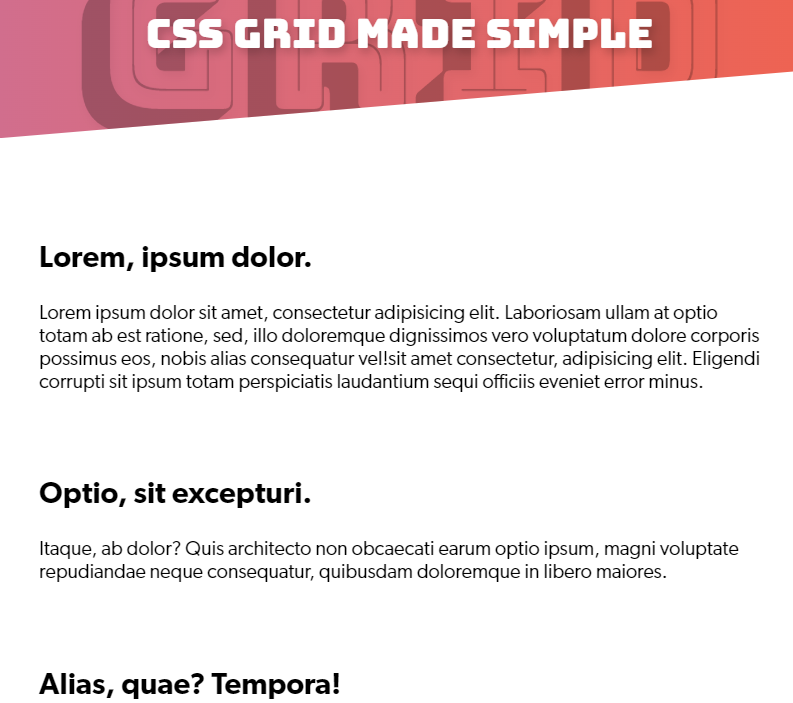

## Trick :  responsive grid layout

### FROM


### TO




#### what is grid-auto-flow : column; ?
```css
.grid-container {
  display: grid;
  grid-template-columns: 100px 100px 100px;
  grid-auto-flow: column;
}
```
The grid-auto-flow property controls how the auto-placement algorithm works, specifying exactly how auto-placed items get flowed into the grid. By default, the auto-placement algorithm places items by filling each row in turn, adding new rows as necessary. The grid-auto-flow property controls the direction in which the auto-placement algorithm fills in the grid.

#### what is grid-auto-flow : row; ?
```css
.grid-container {
  display: grid;
  grid-template-columns: 100px 100px 100px;
  grid-auto-flow: row;
}
```
The grid-auto-flow property controls how the auto-placement algorithm works, specifying exactly how auto-placed items get flowed into the grid. By default, the auto-placement algorithm places items by filling each row in turn, adding new rows as necessary. The grid-auto-flow property controls the direction in which the auto-placement algorithm fills in the grid.